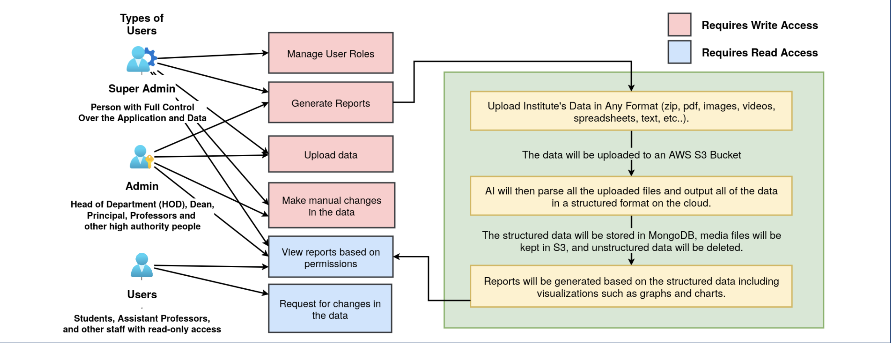

  

<em>A web-based platform built for educational institutions to automate annual report generation using Artificial Intelligence. The system leverages Large Language Models (LLMs) to process and organize unstructured data into structured, actionable insights. We are transforming raw data into interactive, detailed, and customized reports, one click at a time.</em>

## Problem Statement 

### SIH - 1641

> _Create an Annual Report Portal for institute where all the departmental reports can be integrated and customized._

<h2 align="center">📄 Description </h2>

Educational institutes generate large volumes of data annually—academic results, research publications, finances, achievements, and more. Manually compiling this into a structured, insightful annual report is time-consuming and prone to errors. The goal is to develop a robust and user-friendly portal that automates data collection, organization, analysis, and visualization across departments, enabling the creation of dynamic, accurate reports with minimal manual effort.

The portal should feature secure role-based user authentication, integration with external tools (e.g., student/finance systems), real-time analytics, customizable dashboards, and automated report generation (PDF, HTML, etc.). It should support collaboration, feedback collection, version control, and multimedia-rich content. A clean, responsive UI, multilingual support, and adherence to data privacy standards (GDPR, FERPA) are essential. The end solution must be scalable, adaptable to various institutes, and capable of processing large datasets efficiently.

##  Tech Stack

### Front-End

  
  
  
  
  

### Back-End

  
  
  

### Database

  
  
  

### Tools & Services

  
  
  
  
  

### Artificial Intelligence

  
  
  
  
  
  
  
### Deployement

  
  

## Workflow

  

## Architecture

  

  

<h2 align="center">🛠️ Technical Architecture</h2>

- Users authenticate via **Express.js** and **JWT**, with **role-based access control** managing visibility.
- User credentials and metadata are securely stored in **MongoDB**, with encryption for all sensitive data.
- Uploaded files (e.g., exported from TallyERP or Academia) are stored in an **AWS S3 Bucket**.
- Unstructured uploaded data is processed by an **Ollama AI model** to convert it into structured **JSON**.
- The structured data is stored back into **MongoDB**, also encrypted for security.
- For analytics, structured data is sent again to **Ollama AI**, which prepares it for **Chart.js** visualizations.
- **Chart.js** renders interactive graphs and charts on the frontend, enabling drill-downs and detailed exploration.
- The platform ensures full data security, scalability, and AI-driven automation in both data processing and reporting.

<h2 align="center">🔁 System Flow Summary</h2>

1. User logs in (role-based access).
2. Uploads data → stored in **AWS S3**.
3. **Ollama AI** structures the data → stored in **MongoDB**.
4. Data is encrypted for security.
5. **Ollama AI** generates chart-compatible data → rendered using **Chart.js**.
6. Reports support interactive exploration.

## 📚 Research References
  

This repository includes resources and references gathered during the course of exploring topics related to automation, education, spreadsheet reliability, and academic tools.

---

### 📄 Articles & Reports

### 1. **Spreadsheet Errors in Business**
- **Title:** *Sorry, Your Spreadsheet Has Errors (Almost 90% Do)*  
- **Author:** Leung, S.  
- **Published by:** Forbes – Salesforce BrandVoice  
- **Date:** September 15, 2014  
- **Link:** [Read Article](https://www.forbes.com/sites/salesforce/2014/09/13/sorry-spreadsheet-errors/)  

### 2. **Future of Work & Automation**
- **Title:** *Harnessing Automation for a Future That Works*  
- **Authors:** Manyika, J., Chui, M., Miremadi, M., Bughin, J., George, K., Willmott, P., & Dewhurst, M.  
- **Published by:** McKinsey & Company  
- **Date:** 2017  
- **Link:** [Read Report](https://www.mckinsey.com/featured-insights/digital-disruption/harnessing-automation-for-a-future-that-works)

### 3. **Historical Perspective on Automation in Education**
- **Title:** *Automation in Training and Education*  
- **Authors:** Kearsley, G., & Seidel, R. J.  
- **Published in:** Human Factors, Volume 27(1), Pages 61–74  
- **Date:** 1985

---

## 🧠 Tools & Technologies

### 4. **LangChain**
- **Title:** *Introduction to LangChain*  
- **Publisher:** LangChain Documentation  
- **Link:** [Explore LangChain](https://python.langchain.com/v0.2/docs/introduction)

### 5. **IPU Academic Leaderboard**
- **Repository:** [LakshayGMZ/ipuSenpai](https://github.com/LakshayGMZ/ipuSenpai)  
- **Description:** A modern, open-source, beautifully designed academic leaderboard for IPU students.  
- **Author:** LakshayGMZ

---

## 🏛 Institutional Reports

### 6. **College Annual Reports – Lady Shri Ram College**
- **Link:** [View Reports](https://lsr.edu.in/college-annual-reports/)

### 7. **Indian Institute of Technology – Annual Report**
- **Title:** *Annual Report 2022–2023*  
- **Institute:** IIT Delhi  
- **Link:** [Download Report (PDF)](https://rti.iitd.ac.in/sites/default/files/inst_manuals/AR-2022-23-E.pdf)

---

## ✅ How to Use

This collection serves as foundational material for understanding:
- The importance of error-free data tools.
- The role of automation in modern learning.
- Real-world applications of AI/ML tools like LangChain.
- Examples of academic transparency and open-source educational tools.

Feel free to fork this repo and build on the research!

---

## 🛠 License

This project uses public resources for educational and non-commercial research purposes. Please refer to individual links and platforms for their respective usage rights and licenses.

## 2. Features 

## 3. Installation instructions

## 4. Configuration
All the details on configuration options,environment variables and how to set them.

## 5. API Documentation 
Details on any API used and Endpoints, request/response formats, and example calls.

## 6. Snippets of website 

## 7. Live-Link 
When deployed on vercel/netlify or whatever static site deployment we use.

## 8. Use-Cases

## 9. Deployment
Details on hosting services, deployment commands, and configuration.

## 10. License
Any legal information regarding the use and distribution of the project.

## 11. Contributors 
Github links of you all to be put in here and some contact info.

## 12. Contributing (optional)
Guidelines for contributing to the project.

